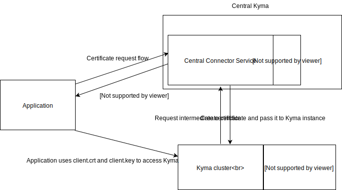

# Connector service with two phase pairing

Created on 2018-12-17 by Lukasz Szymik (@lszymik).

## Status

Proposed on 2018-12-17.

## Motivation

The Connector service is responsible for establishing a secure connection between a connected application and Kyma runtime. It is achieved by providing the client certificate which is later validated by the Application Connector.
A client certificate is used for registering application metadata, like APIs, and sending events to Kyma. The registration of application metadata and sending events are separated functionalities. They can be realized using different components deployed on different Kyma clusters.
Therefore, the connection flow must be extended to support cases where the Application Registry can be separated from the Kyma runtime. 

## Goal

1. The Connector service handles client certificate provisioning for an App Registry connection.
1. An endpoint for getting metadata information with App Registry URL, Event service URL is exposed and accessible with the use of the client certificate. Metadata can be extended to support automated communication between Kyma and connected applications. Example, the Event service endpoint can be changed, and application configuration must be updated.
1. The Connector service handles client certificate provisioning for a Kyma runtime using the first client certificate.
1. The new client certificate can be requested using the previous one (certificate rotation)
1. The Connector service can trigger the creation of the application custom resource if it doesn't exist yet.

## Suggested solution

Connector service is extended to work with two phases:

  - In the first phase, the Connector service is returning cluster metadata for CSR signing and information about App Registry URL.
  - In the second phase, the Connector service is returning metadata of the Kyma runtime cluster for which a second client certificate can be obtained.

Both phases can be realized using the same Connector Service, or there could be two separated Connector Service (central one handling App Registry for multiple Kyma runtimes and seconds one in each Kyma runtime)

### Component Diagram

### Flow Diagram

#### Application is requesting client certificate

1. An application is requesting CSR information by sending registration token.
2. Information about CSR requirement and URL for signing it is returned.
3. CSR is created and send for a signing.
4. The client certificate is returned with information about App Registry endpoint and Info endpoint.

**Security:** The security is based on one-time tokens.

#### Application is registering metadata

1. An application is registering all APIs and Event catalogs in App Registry. It might be a single call or multiple separated calls.
2. An application is able to update registered metadata.

**Security:** The client certificate is representing the connected application.

#### Application is getting Kyma metadata

1. An application calls info endpoint.
2. The information about Kyma runtime is returned. The information contains: App Registry URL, Event service URL, Connector service in Runtime (with connection token.)
3. An application is updating its configuration if something changed (e.g., new Event Service URL, the certificate is expiring, and a new one must be fetched.)
4. The calls should be executed periodically (pulling). It will be used as a heartbeat from the connected application.

**Security:** The client certificate is representing the connected application.

#### Application is connecting to the Kyma runtime

1. An application can access Kyma runtime using the client certificate generated by the central Connector Service.
2. Runtime validates the certificate as well as tenant and runtime inforamtions stored in Subject

**Security:** The client certificate is representing the connected application.

#### Application is sending events to Kyma

1. The call to Event service with a second client certificate.

**Security:** The client certificate from phase two is representing the connected application.

#### Application is requesting client certificate renewal

1. The application is sending a new CSR
2. Connector service is returning a signed client certificate

**Security:** The connector service is returning new certificate based on an already valid one. If certificate already expired then pairing process need to be started again.

### Additional improvements and comments

#### Store additional metadata for application

- The application custom resource might be extended with additional metadata like a tenant, application group, etc.
- The metadata will be used for a better description of the connected application.
- The additional metadata can be provided with default values injected during runtime deployment.

#### Kyma as a standalone cluster

- The connector service might work with two phases approach on a single Kyma cluster.
- The info endpoint will return the same addresses.
- The same connector service will provide both client certificates.
- The configuration flag might control it.